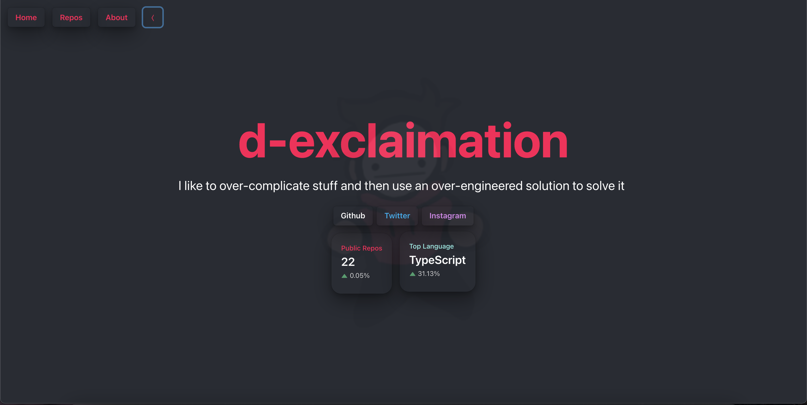

# exclaimation

Updated personal website / app using SSR with [`nextjs`](https://github.com/vercel/next.js/)



### Front-end stack

### Tech Stackfor the entire thing (at least the thing I want to use)

> 1. React
> 2. Typescript
> 3. Go
> 4. Postgres
> 5. GraphQL

```ts
const app = (): void => {
  console.log(`Thanks for checking this out, ${you}!`);
};
```
